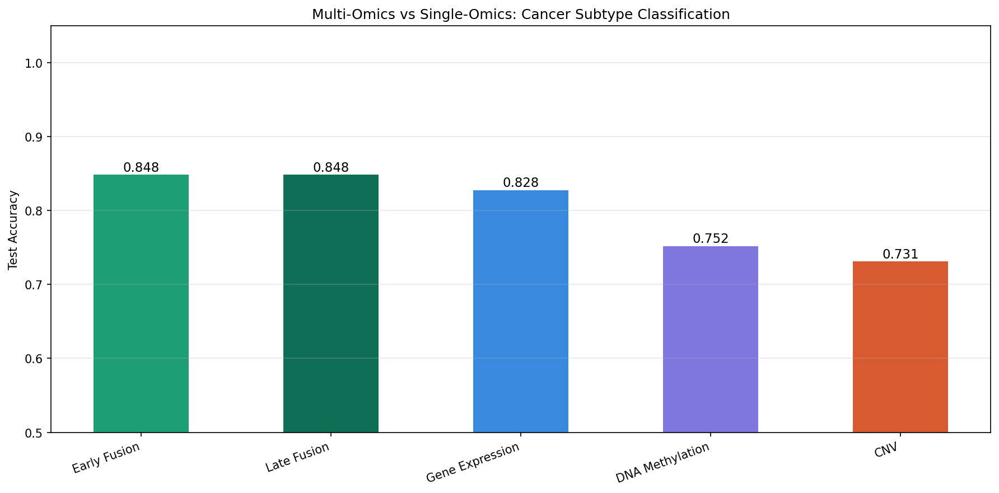
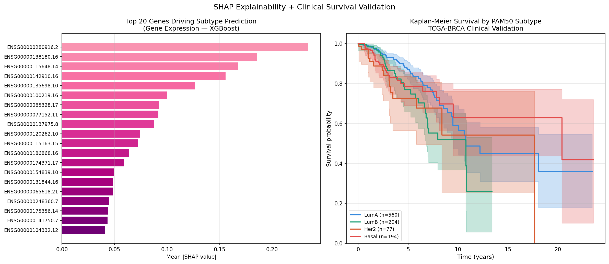
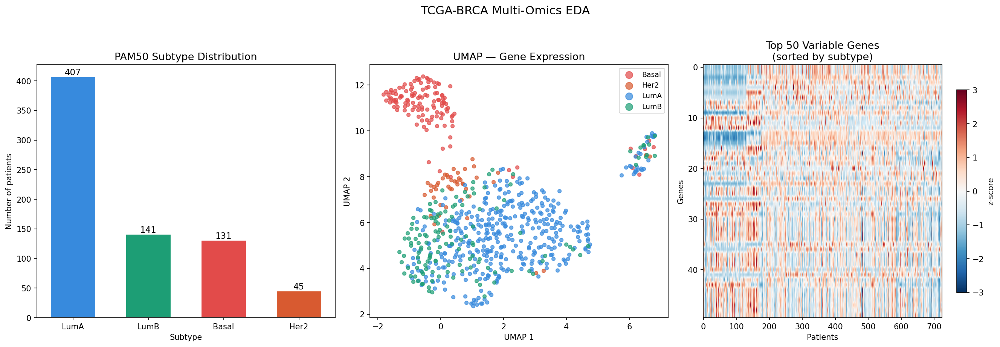

# TCGA-BRCA Multi-Omics Cancer Subtype Classification

Classifying breast cancer into PAM50 molecular subtypes using
gene expression, DNA methylation and CNV from 724 TCGA-BRCA patients.

## Results

| Model | CV Accuracy | Test Accuracy |
|-------|------------|--------------|
| Early Fusion (multi-omics) | **90.1%** | **84.8%** |
| Gene Expression alone | 89.2% | 82.8% |
| DNA Methylation alone | 77.9% | 75.2% |
| CNV alone | 73.2% | 73.1% |

## Key Figures

### Multi-omics Comparison


### SHAP + Survival Validation


### EDA Overview


## Dataset
- Source: TCGA-BRCA (GDC portal)
- Patients: 724 (after 3-omics alignment)
- Subtypes: LumA(407), LumB(141), Basal(131), Her2(45)
- Gene expression: 5,000 top variable genes
- DNA methylation: 402,747 CpG probes → 500 PCs
- CNV: 60,623 gene-level segments

## Pipeline
1. Download via TCGAbiolinks (R)
2. Align 3 omics to common patients
3. PCA on methylation (90.97% variance)
4. Single-omics classification (RF + XGBoost)
5. Multi-omics fusion (early + late)
6. SHAP explainability + survival validation

## Tools
Python, R, TCGAbiolinks, scikit-learn, XGBoost,
SHAP, lifelines, UMAP, pandas, matplotlib

## How to Run
```bash
conda env create -f environment.yml
conda activate tcga-project
Rscript R/01_download_expression.R
Rscript R/02_download_methylation.R
Rscript R/03_download_cnv.R
python notebooks/02_preprocessing_v2.py
python notebooks/03_eda.py
python notebooks/04_single_omics.py
python notebooks/05_multi_omics_fusion.py
python notebooks/06_shap_survival.py
```

## Author
Vishnuprabha Uvaraj
